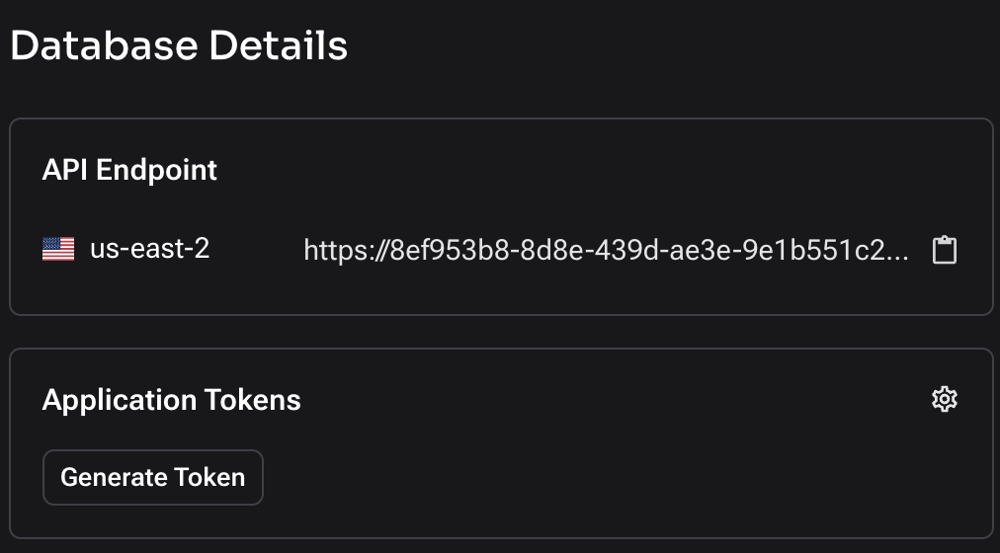
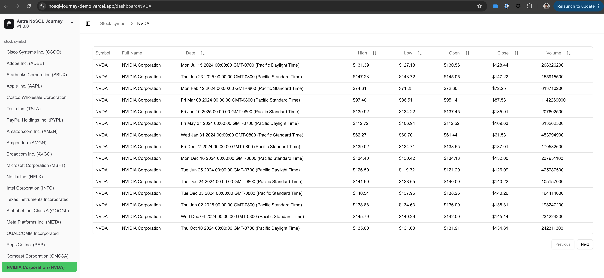

**Welcome to the SKO NoSQL journey!**
You are seeing the stock data fullStack demo app. This app is built using [AstraDB](https://docs.datastax.com/en/astra-db-serverless/index.html), [Astra Data API](https://docs.datastax.com/en/astra-db-serverless/api-reference/dataapiclient.html), [Data API TypeScript client](https://docs.datastax.com/en/astra-db-serverless/api-reference/typescript-client.html), [Next.js](https://nextjs.org/docs), and [Vercel](https://vercel.com/).

In this journey, you will follow the README to implement the app with
1. **Data API Collection**: [Learn more](https://docs.datastax.com/en/astra-db-serverless/api-reference/collections.html)
2. **Data API Table**: [Learn more](https://docs.datastax.com/en/astra-db-serverless/api-reference/tables.html)

You will see the app UI on your local machine and eventually deploy it to Vercel.

We aim to provide an experience where you can appreciate the fast speed of Astra for reading/writing data, the ease of using the Data API collections and tables for interacting with your Astra DB.


## Prerequisites

To get started with this project, ensure you have the following:

- **Node.js**: Version 22 or above. 
- **Astra DB**: Obtain the endpoint and token.
- **GitHub Account**: For git operation and vercel use.
- **Vercel Account**: A free vercel account for deploying the app in vercel.

### Astra DB prerequisites
1. Create a database in astra.
2. Get the endpoint and token.



## project Structure

The project directory is organized as follows:
(To minimize the distractions, we will only introduce the some components, and emphesize the parts you will be working on)

```
/nosql-journey-demo
├── .env.example 
├── node_modules
├── package.json
├── package-lock.json
├── README.md
├── /src
│   ├── /app
│   │   ├── /dashboard
│   │   │   ├── /[symbol]
│   │   |   ├── page.tsx
│   ├── /components
│   │   ├── /ui
│   │   ├── data-table.tsx
│   ├── /lib
│   │   ├── /datasets
│   │   │   ├── NVDA_1Y.csv
│   │   │   ├── MSFT_1Y.csv
│   │   │   ├── (other dataset files...)
│   │   ├── seed-collection.ts
│   │   ├── seed-table.ts
│   │   ├── model.ts
│   │   ├── astradb.ts
```

- `/.env.example`: File for you to copy and create .env file.
- `/src/app/dashboard/page.tsx`: Stock dashboard component that you will see in the UI.
- `/libs/datasets`: Nasdaq stocks and trades csv data files.
- `/libs/model.ts`: Export data model and also funtions to read corresponding data from Astra.
- `/libs/astradb.ts`: Export Data API typescript Astra client.
- `/libs/datasets`: Nasdaq stocks and trades csv data files.
- `/seed-collection.ts`: Data preparation script to read stock data file and populate into Astra DB collection.
- `/seed-table.ts`: Data preparation script to read trade data file and populate into Astra DB table.
- `.gitignore`: Specifies files to be ignored by Git.
- `README.md`: Project documentation.
- `package.json`: Project dependencies and scripts.
- `next.config.js`: Next.js configuration file.


## NoSQL Journey

### Create .env file
By now you should have Astra DB endpoint and token ready.
Then you can reference the [.env.example](./env.example) file, and create a new file ".env".

> ASTRA_DB_API_ENDPOINT="YOUR_ASTRA_DB_ENDPOINT"
> ASTRA_DB_APPLICATION_TOKEN="YOUR_ASTRA_TOKEN"

Sample values:
> ASTRA_DB_API_ENDPOINT="https://8ef953b8-8d8e-439d-ae3e-9e1b551c21db-us-east-2.apps.astra.datastax.com"
> ASTRA_DB_APPLICATION_TOKEN="AstraCS:DhksOhSxxxxxxxxx"


### Populate Astra DB 
Have a look at [seed-collection.ts](./src/lib/seed-collection.ts), [seed-table.ts](./src/lib/seed-table.ts) scripts file.

Run the script with following command.
```sh
npm run seedCollection
npm run seedTable
```

You can verify in the Astra portal, there are stock and trade data in your DB now.


### Start the app
Now we have the data ready in your AstraDB, then we can start the app in your local and see how it looks with Astra support!

Since it is the first time running the app, install all the dependencies first.
```sh
npm install
```

Then start the app with following command.
```sh
npm run dev
```

Once the app is ready, bring the front-end UI up in [http://localhost:3000](http://localhost:3000)


## Deploying to Vercel
To deploy the app in Vercel, follow these steps:

1. You should fork the repo and pushed codes to your own github repo.
2. Login into [vercel](https://vercel.com/login).
3. On the Overview page, click (Add New..) -> (Project) -> (import Git Repository you just created).
4. On the project creation page, leave everything as default, add new environment variables.
> ASTRA_DB_API_ENDPOINT : "YOUR_ASTRA_DB_ENDPOINT"
> ASTRA_DB_APPLICATION_TOKEN : "YOUR_ASTRA_TOKEN"
5. Once the build finishes, you will see the dashboard!


